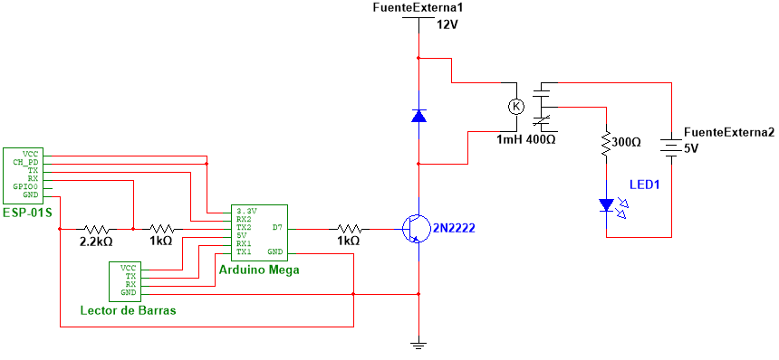
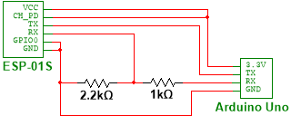

# Barcode-control-and-logger-circuit
My final project for my Automation and Control course during my 7th semester at the Autonomous University of Baja California (August - December, 2021): a barcode control circuit with MySQL logger.

The idea for the system came from my professor of that course, who kept getting frustrated by students leaving the computer lab equipment turned on when they leave and thus waste a lot of electricity. He wanted a system that makes it a requirement for students to insert their student IDs into a barcode reader in order to energize the lab equipment to be able to use it; conversely, the lab equipment has to become deenergized when students remove their IDs from the barcode reader to leave the labs. Additionally, when a student inserts their ID into the reader, their ID number has to be logged into a MySQL database alongside the date and time of the insertion; when the ID is removed, it has to save the date and time of removal.

## Objective
This project is a smaller prototype of that system, where the load circuit, instead of being an AC circuit that consists of the lab equipment, is a much smaller DC circuit that only contains a small red LED. The objective of this prototype is to energize the LED when a student ID is inserted into the barcode reader (as well as log into a MySQL database the ID number and the date and time of "arrival") and to deenergize the LED when the ID is removed (as well as log into the database the date and time of "departure").

## Circuit diagram

## Components and tools
A Waveshare Barcode Scanner Module.  

An ESP-01S (for the Wi-Fi connection to the MySQL server).  

An Arduino Mega (to receive the ID number read by the barcode reader and send it to the ESP for publishing; also to control the load circuit).  
  
I chose an Arduino Mega because I already had it in my possession from an internship (I was allowed to keep it); it having multiple hardware serial ports helps a lot since both the ESP-01S and the barcode reader use serial communication. Alternatively, it's possible to make this same project with an Arduino Uno and use SoftwareSerial to make the additional needed serial ports, but my Arduino Uno at the time didn't have its ATmega328P chip inserted, so I couldn't use it as an actual microcontroller; it did, however, come in handy for programming the ESP-01S. It's also possible to replace the Arduino and the ESP-01S with either an ESP8266 microcontroller or any Arduino board with built-in Wi-Fi, although that would require bigger modifications of my code.

A SUN HOLD RAS-1215 relay (to control the flow of electricity of the load circuit with its normally open contacts; according to its [datasheet](https://www.sunhold.com/upload/prd1/109-3.pdf), it requires to be fed 12V and 30mA for its normally open circuit to close).  

A 2N2222 transistor (used as a switch for an external power source to energize the relay, since the Arduino on its own can't output enough voltage for the relay).  

A 1N4004 diode (acts as a flyback diode for the relay).  

An LED.  

A 12V power source (to power the relay); my power source was an array of three 3.7V batteries connected in series, which in theory should deliver only 11.1V but measuring the actual ouput of the array with a multimeter results in a reading of 12V.  

A 5V power source (to power the LED); my power source was a USB cable connected to my computer.  

A 300Ω resistor for the LED. The red LED, according to its [datasheet](https://www.farnell.com/datasheets/1498852.pdf), has a max continuous forward current ($I$) of 20mA and has a forward voltage ($V_f$) of 2V. Since the LED will be fed with a 5V power source ($V_s$), the minimum resistance the LED needs is $R=(V_s-V_f)/I=(5V-2V)/20mA=150Ω$; the resistor with the closest value to 150Ω that I could find was a 300Ω one, which results in a current of $I=V/R=3V/300Ω=10mA$.

A 1kΩ and 2.2kΩ resistor to form a voltage divider for the ESP-01S. The ESP-01S takes in 3.3V through its RX pin for serial communication, but the Arduino Mega's TX pins are 5V pins. Thus, a voltage divider is needed to reduce the Arduino's 5V to 3.3V suitable for the ESP. To start my calculations, I first proposed a 1kΩ resistor as $R_1$, so to find $R_2$: $R_2=(V_oR_1)/(V_{in}-Vo)=(3.3V\times1kΩ)/(5V-3.3V)=1941.18Ω$. The closest value of resistor I could find was 2.2kΩ, which results in an output of $V_o=(R_2V_{in})/(R_1+R_2)=(2.2kΩ\times5V)/(1kΩ+2.2kΩ)=3.44V$, which is reasonably close to 3.3V.

A 1kΩ resistor for the transistor's base. Since the relay, which is connected to the transistor's collector, requires a current of 30mA ($I_C$), and a 2N2222 transistor has a max $\beta$ of 300 (according to its [datasheet](https://www.farnell.com/datasheets/296640.pdf)), then to put the transistor into saturation (and thus allow the 12V source to feed the relay) I'd need in the transistor's base a minimum current of $I_B=I_C/\beta=30mA/300=100μA$. Since the Arduino Mega's digital ports output 5V ($V_{in}$), and the minimum base-emitter saturation voltage ($V_{BE}$) of a 2N2222 is 0.6V (according to the datasheet again), then in the base of the transistor I'd need a resistor of at most $R=(V_{in}-V_{BE})/I_B=(5V-0.6V)/100μA=44kΩ$. For simplicity and to assure saturation, I decided to use a 1kΩ resistor, which results in a base current of $I_C=V/R=5V/1kΩ=5mA$, much higher than the required 100μA and still appropriate for the 2N2222, which lists in its datasheet base currents of up to 50mA.

Finally, a breadboard on which to build the system.

Additionally, I also use my chip-less Arduino Uno to flash the code into the ESP-01s. I used the following circuit in order to do that (note that this circuit also utilizes the voltage divider, since the Arduino Uno's digital ports are also 5V):  

I also used a cardboard box to create a makeshift "card holder" in which to insert my ID so it's read by the scanner:  

## Software
First it's necessary to install [Uniform Server](https://www.uniformserver.com/), which I used to host the MySQL database and a webpage with Apache. I used phpMyAdmin to create a new MySQL database called **log_mesas** ("mesas" means "tables" in Spanish) and a new table in it called **sjm2** (which stands for "<ins>s</ins>alón <ins>J</ins>, <ins>m</ins>esa <ins>2</ins>", which is Spanish for "room J, table 2", a reference to a room and table in the computer lab). The **sjm2** table is created with the following fields:  

- An "id" field of type INT that acts as the primary key with auto increment.
- A "matricula" (student number) field of type INT.
- An "entrada" (entrance) field of type DATETIME and a default value of CURRENT_TIMESTAMP to save the date and time of the student's arrival.
- A "salida" (exit) field of type DATETIME, a NULL default value and a "on update CURRENT_TIMESTAMP" attribute to save the date and time of the student's departure. This is the only field allowed to be NULL.

Next up, it's necessary to configure Apache to allow access to its webpage from other devices in the network so the ESP-01s can send data to it. I did it by modifying the file "www/.htaccess" in Uniform Server's folder; you can allow all external connections, or allow just a range of IPs (which of course has to include the ESP's IP). It's also possible that your Firewall ends up blocking the access from other IPs, so you might have to configure IP exceptions into the Firewall too. Once this is configured, in Apache's "www" folder you have to insert two php files:
- [activa.php](www/activa.php), which takes the "matricula" (student number) sent by the ESP in a POST request and saves it in the MySQL database alongside the date and time of arrival.
- [desactiva.php](www/desactiva.php), which updates into the MySQL server the date and time of departure.

Both of these files have to be modified with the correct MySQL username and password, if you don't want to or can't use the default root credentials.

Finally, upload [ESP.ino](ESP.ino) into the ESP-01S and upload [Arduino.ino](Arduino.ino) into the Arduino Mega.

## Barcode scanner configuration
The Waveshare Barcode Scanner can be configured by using it to scan different QR codes provided by the scanner's [user manual](https://files.waveshare.com/upload/d/dd/Barcode_Scanner_Module_Setting_Manual_EN.pdf). The configuration required for this project is:
- **Enable UART&All-Code** (to allow the scanner to send its readings to the Arduino through the serial ports)
- **115200bps** (to set the scanner at the same serial speed as the Arduino)
- **Continuous Mode** (to set the scanner in continuous scanning mode so you don't need to press the scanner's button to scan)
- **No Interval** (so the scanner doesn't wait any time between scans)
- **Enable silence** (so the scanner doesn't beep everytime it scans something)
- **Add Tail CRLF** (so that each reading of the scanner is separated from the previous reading by a Carriage Return and a Line Feed)

## Result
A video of the system in action: https://drive.google.com/file/d/1mDKOGagtiVmFatDjXft3mKnqPdKazZzm/view?usp=sharing
